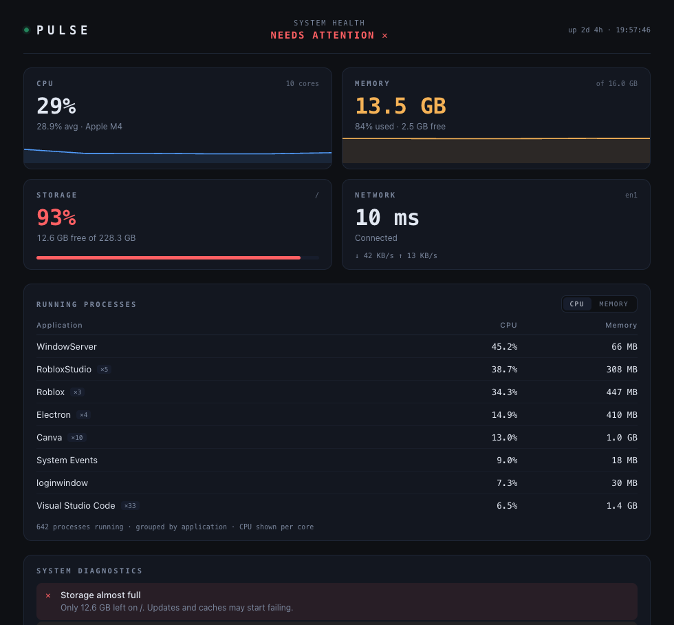
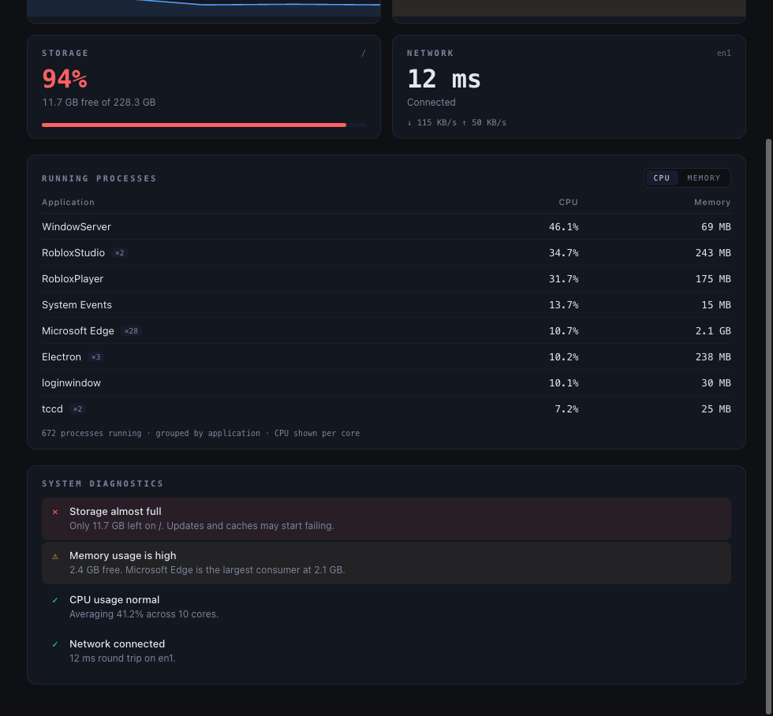

# Pulse System Monitor

Lightweight desktop system monitor for tracking CPU, memory, storage, network activity, processes, and system health in real time.

## Overview

When a computer slows down, most tools tell you *that* something is wrong — 89% memory used — without telling you *what*. Pulse answers the second question.

It reads live metrics from the machine every two seconds, groups running processes by application, and runs a small rules engine over the result to produce plain-language findings like "Memory usage is high. Microsoft Edge is the largest consumer at 2.1 GB."

Every number in the interface is read from the operating system. There is no sample data, no simulation, and no network service behind it.

## Features

- **CPU** — live utilization with a rolling sparkline, core count, and a short-window average that smooths out momentary spikes.
- **Memory** — used and free bytes with a usage sparkline, based on *active* memory rather than the near-100% figure that includes filesystem cache.
- **Storage** — capacity and free space for the volume that actually fills up (see [Architecture](#architecture)).
- **Network** — round-trip latency, the active interface, connection state, and live throughput.
- **Processes** — top applications by CPU or memory, grouped so a browser's 28 helper processes read as one row, not 28.
- **Diagnostics** — the rules engine that turns those readings into findings, sorted problems-first, each one naming the process responsible where there is one.

## Screenshots

**Dashboard**



**Diagnostics**



## Technology

| Layer | Choice |
| --- | --- |
| Shell | Electron 44 |
| Runtime | Node.js |
| Interface | HTML, CSS, vanilla JavaScript — no framework, no build step |
| System data | [`systeminformation`](https://github.com/sebhildebrandt/systeminformation) |

Two runtime dependencies, no database, no accounts, no cloud services.

## Installation

Requires Node.js 18 or newer.

```bash
git clone https://github.com/<your-username>/pulse-system-monitor.git
cd pulse-system-monitor
npm install
npm start
```

To check the data layer without launching the interface:

```bash
npm run probe
```

This prints one real snapshot — metrics, grouped processes, and the diagnostics verdict — straight to the terminal.

## Architecture

```
src/
├── main/
│   ├── main.js        Electron entry: window, 2s polling loop, IPC
│   ├── metrics.js     Reads the machine; the only module touching the OS
│   └── preload.js     contextBridge — exposes exactly three functions
├── diagnostics/
│   └── diagnostics.js Pure rules engine: snapshot in, findings out
└── renderer/
    ├── index.html
    ├── styles.css
    └── renderer.js    Presentation only; no Node access
```

**Data flow.** `main.js` polls `metrics.js` every two seconds, passes the snapshot through `diagnostics.js`, and sends the combined result to the renderer over IPC. The renderer draws it. Data moves in one direction only.

**Process isolation.** The renderer runs with `contextIsolation: true` and `nodeIntegration: false`, behind a Content Security Policy. Its entire interface to the system is the three functions in `preload.js`.

**Diagnostics own the thresholds.** The engine tags each finding with the resource it concerns, and the renderer colors each card from that verdict. Thresholds live in exactly one place.

Two details worth knowing, because both are easy to get wrong:

- **Memory** reports `active`, not `used`. On macOS `used` counts filesystem cache and sits near 100% permanently, which is true and useless.
- **Storage** reports `/System/Volumes/Data` on macOS rather than `/`. macOS seals the system volume, so reading `/` returns a comfortable-looking 50%-full 24 GB volume while the disk the user is actually filling sits at 94%. It is still labelled `/` in the interface, because that is what it is to the person using it.

**Outbound traffic.** Latency is measured with a single ICMP ping every five seconds. That is the only network request Pulse makes.

## Future Improvements

- Per-core CPU breakdown and GPU utilization
- Temperature and fan sensors
- Alert history, so a spike that happened while you were away is still visible
- Click a process to see its full command and open file handles
- Packaged installers via `electron-builder`
